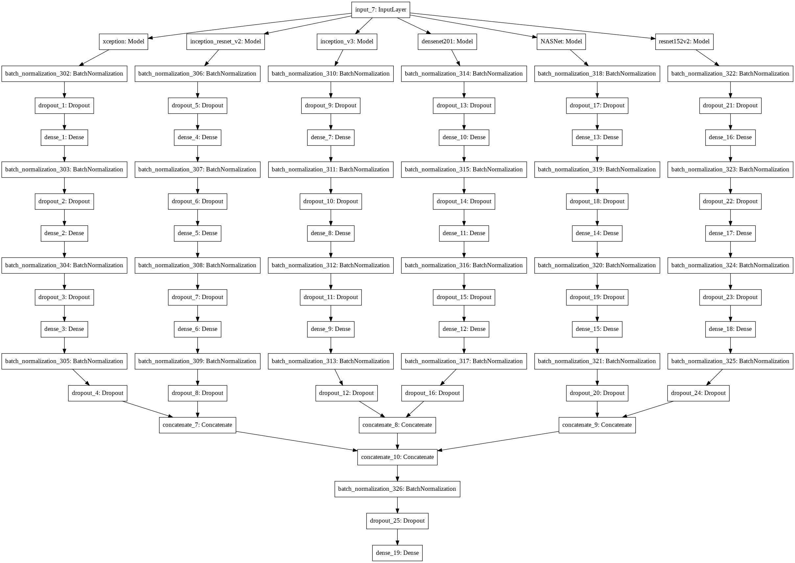

# Auto_tag_images_of_gala
A competition hosted by Hackerearth to auto tag images of gala using various machine learning or deep learning techniques to be more accurate as much we can make it.
I had made my code public here , file named as code.ipynb.

## model used in this code file

## techniques applied for final model
1. Integrated ensembling deep learning model
2. Implementing XGBoost on results taken out from a submodel created from above full model , to boost up final results.

### metrics achieved on 80:20 data split
1. Validation Accuracy : 76.02025 (deep learning model) , With 
2. competition final Score : 82.26843 

## other techniques that can be used to improve models accuracy
1. Using different framework like fastai, etc.
2. if working on keras only:
  1. Adding another model in full model. ( Currently this mode has around 12M parameters which tooked me around 200 sec per epoch on google colab. So choose your another model depending upon computation power available.)
  2. Adding more augmentation techniques ( reduce your batch size otherwise the data wont be able to fit while training. )
  3. Applying average ensembling : Training different individual models seperately and average there predictions with the predictions from above model to be more precised in each and every prediction for class.
  4. More accurate HyperParameter tuning of XGboost model or any other  model which ever you prefer.
